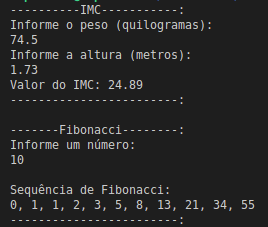

## Challenge 01

### IMC

O (IMC) índice de massa corporal é baseado na altura e peso do individuo.
O calculo é representado por Dividir o peso pela Altura ao quadradro.

Criar uma função que realize o calculo de IMC.

### Fibonacci

Na matemática, a sucessão de _Fibonacci_ (ou sequência de _Fibonacci_), é uma sequência de números inteiros, começando normalmente por 0 e 1, na qual cada termo subsequente corresponde à soma dos dois anteriores. A sequência recebeu o nome do matemático italiano Leonardo de Pisa, mais conhecido por **Fibonacci**, que descreveu, no ano de 1202, o crescimento de uma população de coelhos, a partir desta. Esta sequência já era, no entanto, conhecida na antiguidade.

### Execução do programa

