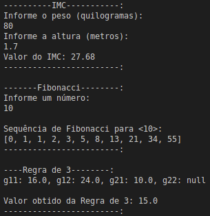

## Challenge 01

### IMC

O (IMC) índice de massa corporal é baseado na altura e peso do individuo.
O calculo é representado por Dividir o peso pela Altura ao quadradro.

Criar uma função que realize o calculo de IMC.

### Fibonacci

Na matemática, a sucessão de _Fibonacci_ (ou sequência de _Fibonacci_), é uma sequência de números inteiros, começando normalmente por 0 e 1, na qual cada termo subsequente corresponde à soma dos dois anteriores. A sequência recebeu o nome do matemático italiano Leonardo de Pisa, mais conhecido por **Fibonacci**, que descreveu, no ano de 1202, o crescimento de uma população de coelhos, a partir desta. Esta sequência já era, no entanto, conhecida na antiguidade.

### Regra de 3

Uma das coisas mais úteis que aprendemos no ensino médio é a "Regra de 3".
Consiste quando temos 3 valores e precisamos saber o quarto.
Geralmente temos dois grupos, e o calculo é feito multiplicando paralelamente os valores entre os dois grupos.
Ex:
--
Grupo1.1       Grupo1.2
           X
Grupo2.1       Grupo2.2
--
Grupo1.1 x Grupo2.2 = Grupo2.1 x Grupo1.2

Sabendo disso, crie uma função que receba 4 argumentos opcionais e que retorne a resolução da regra de 3, levando em consideração que será considerado o argumento vazio como valor a ser encontrado, logo, poderá ter apenas um valor necessáriamente "vazio".

### Execução do programa

